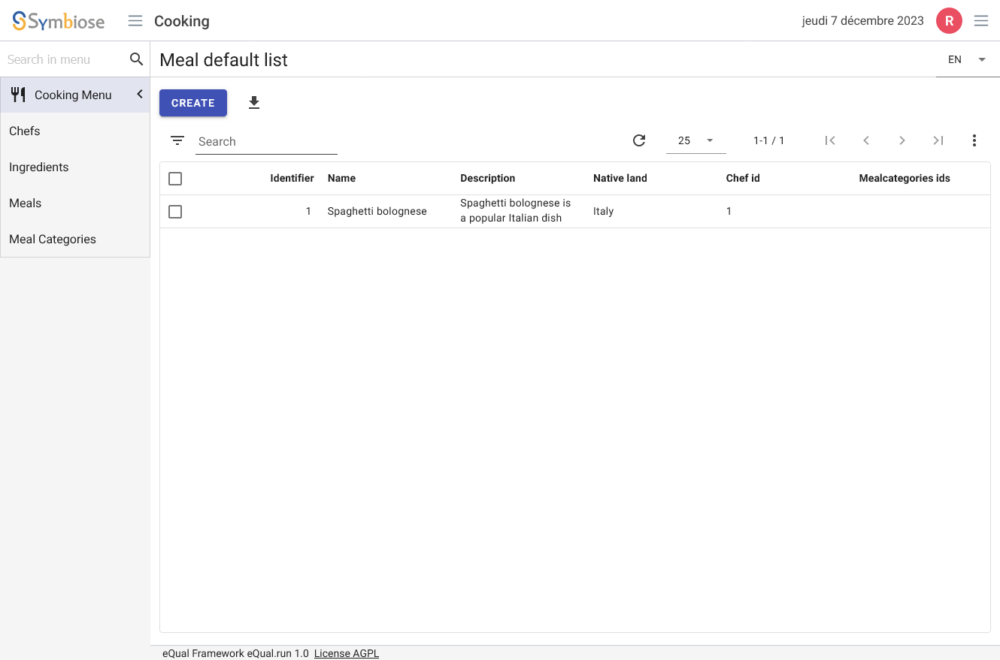
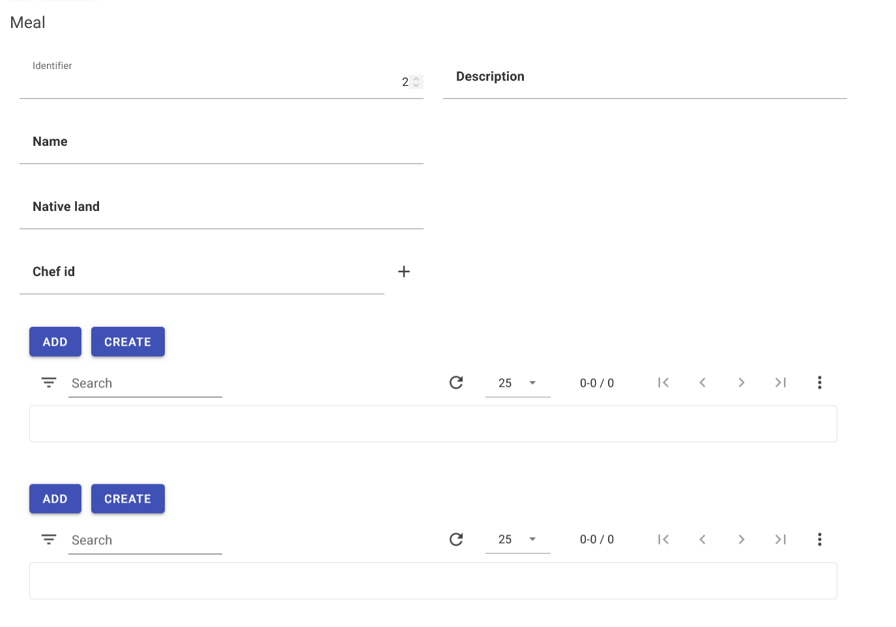

[](https://dl.circleci.com/status-badge/redirect/circleci/S4gF5Pqj58B3FRfUk8sp63/F7aVBC9PhP4Tzm8HSn877w/tree/main)
[](https://github.com/equalframework/equal)
[](https://github.com/swann-martin)

# eQual Framework and Cooking Application Documentation

Welcome to the documentation for the eQual Framework and the cooking application. This document will guide you
through the setup and usage of the eQual Framework, as well as the specific features and components of the cooking
application.

## Welcome

Welcome to the documentation for the eQual Framework and the Cooking Application. This document will guide you through
the setup and usage of the eQual Framework, as well as the specific features and components of the Cooking Application.

## About Cooking

The Cooking package is a simple application for managing meals. It serves as a good example of how to use the eQual
framework to create a simple package.

## Installation Guide

### Clone the Repository

In eQual Framework, apps are treated as packages. Navigate to `/var/www/html/packages` and run the following command:

```bash
cd /var/www/html/packages
git clone https://github.com/AlexisVS/Equal-Package-cooking.git cooking
```

## Model Entity relational


## Package structure

The application is organized into various components, stored within a package folder located under the /packages
directory. In this example, the package is named cooking.

Each package follows this structure:

```
cooking
├── classes
│   └── */*.class.php
├── data
│   └── *.php
├── init
│   └── data
│   	└── *.json
├── views
│   └── *.json
├── manifest.json
```

It corresponds to the MVC pattern. In an eQual package, "classes" represent the Model, "data" regroups the Controllers,
and "views" are the views in JSON format. To create a new project, create a new directory under packages and add
classes, data, views, and the manifest.json.

## Initialize the package and Check its consistency :

Initialize the cooking package using the following CLI command:

### CLI command:

```shell
./equal.run --do=init_package --package=cooking --import=true
```

### URL:

Access the initialization
URL: [?do=init_package&package=cooking&import=true](http://equal.local/index.php?do=init_package&package=cooking&import=true)

This command initializes the cooking package and its dependencies, as indicated in the manifest file.

/packages/cooking/manifest.json:

```json
{
  "name": "cooking",
  "description": "Basic package for testing the framework when we use cooking recipes and foods for dealing with the framework",
  "version": "0.0.1",
  "author": "AlexisVS",
  "licence": "LGPL-3",
  "depends_on": [
    "core"
  ],
  "apps": [
    {
      "id": "cooking",
      "name": "Cooking",
      "description": "Basic package for testing the framework when we use cooking recipes and foods for dealing with the framework",
      "icon": "restaurant",
      "color": "#D32F2F",
      "extends": "app",
      "access": {
        "groups": [
          "users"
        ]
      },
      "params": {
        "menus": {
          "left": "cooking.left"
        }
      }
    }
  ],
  "tags": []
}
```

You can see the tables created in  `equal` database. The names tables are `{{package_name}}_{{entity}}`
You can check that data was imported data by opening the tables `cooking_*` with your prefect DBMS.

Performs consistency checks between DB and class as well as syntax validation for classes (PHP), views and translation
files (JSON). Typing this command.

```shell
./equal.run --do=test_package-consistency --package=cooking
```

### Initial "Fake" Data

The format must respect a pattern. If the class is nest in a subdirectory and if the case is upper or
lower. `init\data\{nameofthepackage}_{entity}.json`

Ensure the data follows a specific pattern. For example, the init data for a Meal instance:

cooking_meal.json:

```json
[
  {
    "name": "cooking\\Meal",
    "lang": "en",
    "description": "Add a meal",
    "data": [
      {
        "id": 1,
        "name": "Spaghetti Bolognese",
        "description": "Spaghetti Bolognese is a popular Italian dish consisting of spaghetti served with a meat and tomato sauce.",
        "native_land": "Italy",
        "chef_id": 1,
        "mealcategories_ids": [
          3
        ],
        "ingredients_ids": [
          1,
          2,
          4,
          5,
          8,
          9,
          10,
          12,
          18
        ]
      }
    ]
  }
]
```

## Model definition

Each model is defined in a `.class.php` file located in the `/packages/cooking/classes` directory. All classes inherit from
a common ancestor: the Model class, declared in the equal\orm namespace and defined in `/lib/equal/orm/Model.class.php`.

In this context, a class is always referred to as an entity and belongs to a specific package. Packages and their
subdirectories are used as namespaces with the format `package_name`.

The standard filename format for these class files is: `{class_name}.class.php`.

### Entity definition of Meal

```php
<?php


namespace cooking;

use equal\orm\Model;

class Meal extends Model
{

    public static function getColumns(): array
    {
        return [
            'name' => [
                'type' => 'string',
                'required' => true,
                'unique' => true
            ],

            'description' => [
                'type' => 'text',
                'required' => false,
            ],

            'native_land' => [
                'type' => 'string',
                'required' => false,
            ],

            'chef_id' => [
                'type' => 'many2one',
                'foreign_object' => 'cooking\Chef',
                'required' => true,
            ],


            'mealcategories_ids' => [
                'type' => 'many2many',
                'foreign_object' => 'cooking\MealCategory',
                'foreign_field' => 'meals_ids',
                'rel_table' => 'cooking_rel_meal_mealcategory',
                'rel_foreign_key' => 'mealcategory_id',
                'rel_local_key' => 'meal_id',
                'description' => 'Meal categories the meal belongs to.'
            ],

            'ingredients_ids' => [
                'type' => 'many2many',
                'foreign_object' => 'cooking\Ingredient',
                'foreign_field' => 'meals_ids',
                'rel_table' => 'cooking_rel_meal_ingredient',
                'rel_foreign_key' => 'ingredient_id',
                'rel_local_key' => 'meal_id',
                'description' => 'Ingredients the meal is made of.'
            ],
        ];
    }
}
```

## Views

In eQual, views are in json.
For each entity, you should have two views : `list` and `form`. These views can be found in the `cooking/views`.

The standard filename format for these views is: `{class_name}.{view_type}.{view_name}.json`.
Pay attention !
The filename format should respect the case of the class. If your class is `Meal.class.php` your view should be
something
like `Meal.list.default.json` or  `Meal.form.default.json`.
It has to match the classes format so if you nested your files in subdirectories for these views
is: `{directory}/{class_name}.{view_type}.{view_name}.json`.

For example `views/Meal.list.default.json` will match the class `classes/Meal.class.php`

### Example of a view



Meal.list.default.json:

```json
{
  "name": "Meal default list",
  "description": "Default list for Meal",
  "layout": {
    "width": "100%",
    "items": [
      {
        "type": "field",
        "value": "id",
        "width": "15%",
        "sortable": true,
        "readonly": true
      },
      {
        "type": "field",
        "value": "name",
        "width": "15%",
        "sortable": true,
        "readonly": true
      },
      {
        "type": "field",
        "value": "description",
        "width": "15%",
        "sortable": true,
        "readonly": true
      },
      {
        "type": "field",
        "value": "native_land",
        "width": "15%",
        "sortable": true,
        "readonly": true
      },
      {
        "type": "field",
        "value": "chef_id",
        "width": "15%",
        "sortable": true,
        "readonly": true
      },
      {
        "type": "field",
        "value": "mealcategories_ids",
        "width": "15%",
        "sortable": true,
        "readonly": true,
        "widget": {
          "type": "many2many",
          "domain": []
        }
      }
    ]
  }
}

```

### Example of form view



views/Meal.form.default.json:

```json
{
  "name": "Meal default form",
  "description": "Default form for Meal",
  "actions": [],
  "layout": {
    "groups": [
      {
        "label": "Meal",
        "sections": [
          {
            "width": "100%",
            "rows": [
              {
                "columns": [
                  {
                    "width": "50%",
                    "items": [
                      {
                        "type": "field",
                        "value": "id",
                        "width": "100%"
                      },
                      {
                        "type": "field",
                        "value": "name",
                        "width": "100%"
                      },
                      {
                        "type": "field",
                        "value": "native_land",
                        "width": "100%"
                      },
                      {
                        "type": "field",
                        "value": "chef_id",
                        "width": "100%",
                        "widget": {
                          "heading": true,
                          "type": "many2one",
                          "domain": [
                            "chef_id",
                            "=",
                            "user.id"
                          ]
                        }
                      }
                    ]
                  },
                  {
                    "width": "50%",
                    "items": [
                      {
                        "type": "field",
                        "value": "description",
                        "width": "100%"
                      }
                    ]
                  }
                ]
              },
              {
                "columns": [
                  {
                    "width": "100%",
                    "items": [
                      {
                        "type": "field",
                        "value": "mealcategories_ids",
                        "width": "100%"
                      }
                    ]
                  }
                ]
              },
              {
                "columns": [
                  {
                    "width": "100%",
                    "items": [
                      {
                        "type": "field",
                        "value": "ingredients_ids",
                        "width": "100%",
                        "widget": {
                          "type": "many2many",
                          "domain": []
                        }
                      }
                    ]
                  }
                ]
              }
            ]
          }
        ]
      }
    ]
  }
}

```

## Check if the rights are correctly set.

```bash
./equal.run --do=test_fs-consistency
```

## Check the package consistency

```bash
./equal.run --do=test_package-consistency --package=cooking
```